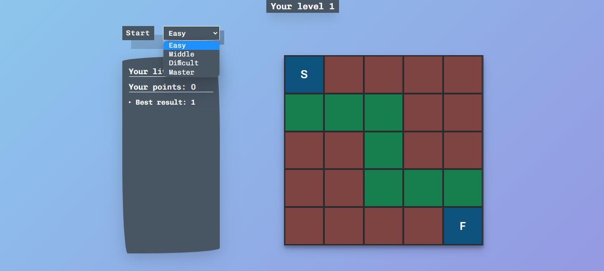
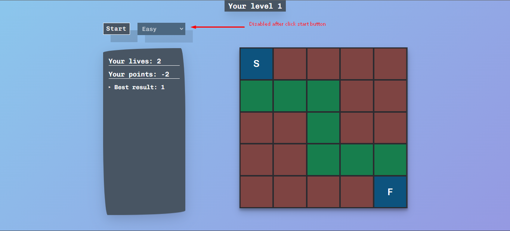
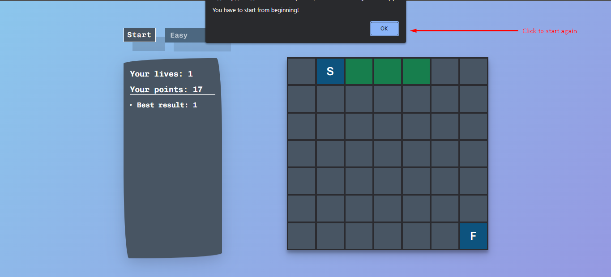

# Remember Way

A simple game where you just need to memorize the path and go through it from start to finish. There are also multiple levels of difficulty.

---

## Built With

JS, HTML, CSS.

## Features

- Remember the path from beginning to end and repeat this path as well.
- Scoring
- Choice of several levels of complexity
- There are only 5 levels

## Demo

[Demo](https://remember-way.vercel.app/)

## How To Use

### Game rules

- Click to start button to begin


- Choose level that you want



- Here you can see lives, points and you best results. And Each block gives you points(depends on level).And if you go beyond the green blocks, then you lose.(Sometimes blocks and even the cursor will not be visible depending on the level)


- After click to start button, you can`t choose level.



- When you have less than 3 lives, you must start again.



## Getting Started

### Installation

1. To run a project locally, first clone the repo

   ```sh
   git clone https://github.com/sapar6ek0v/cinema.git
   ```

2. Run the project locally

## Feedback

If you have any feedback, please reach out to me at eldiiarsparbekov03@gmail.com
